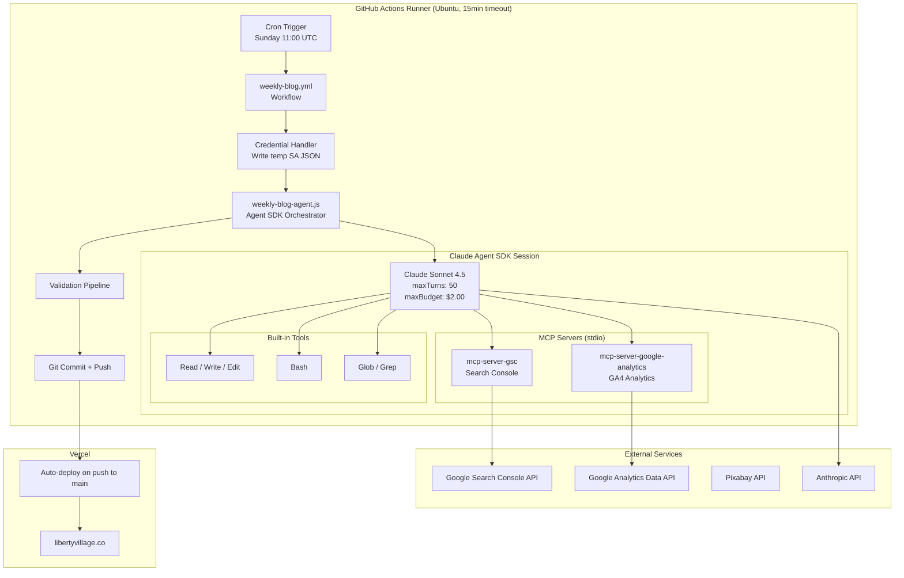
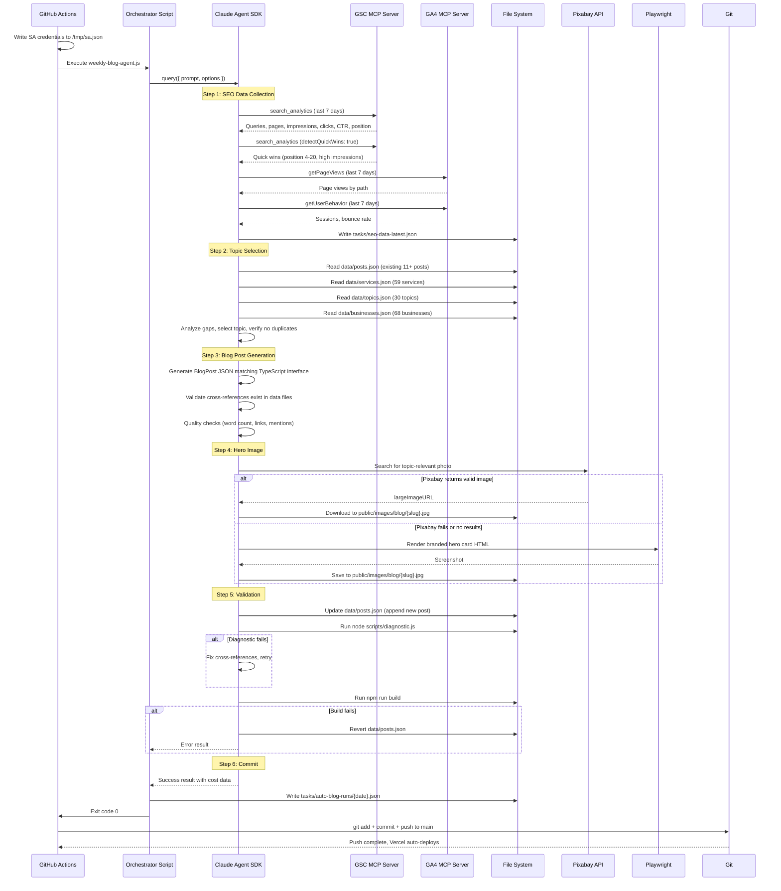
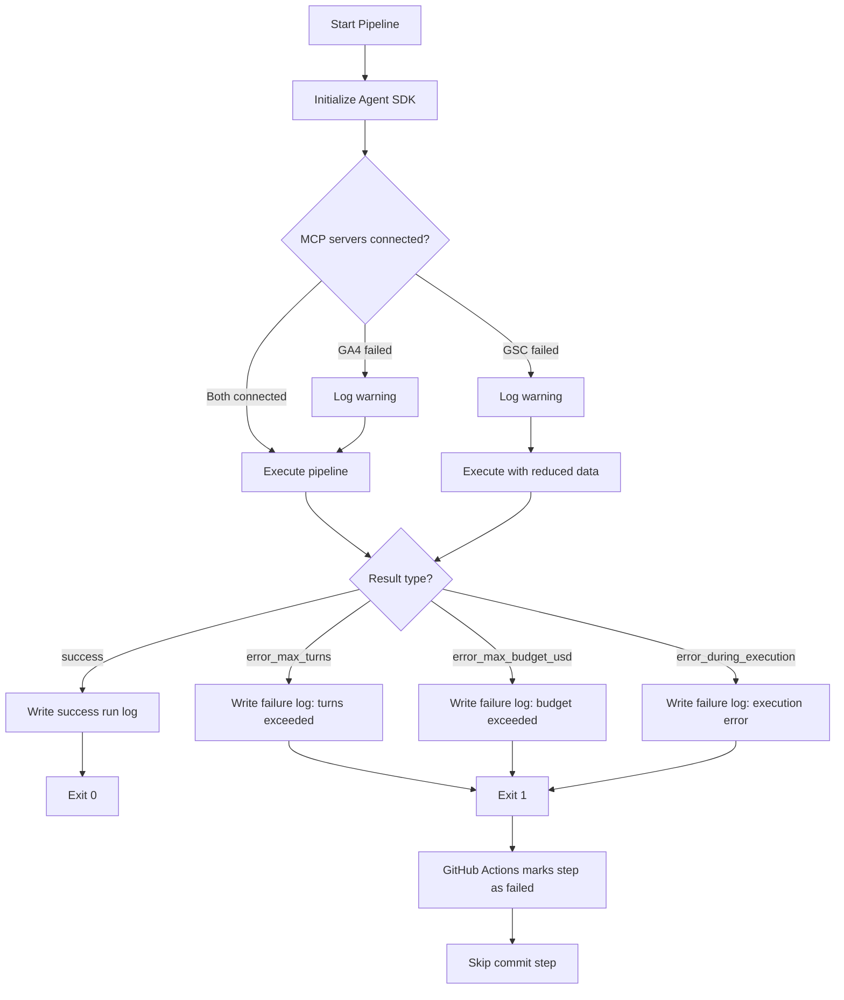
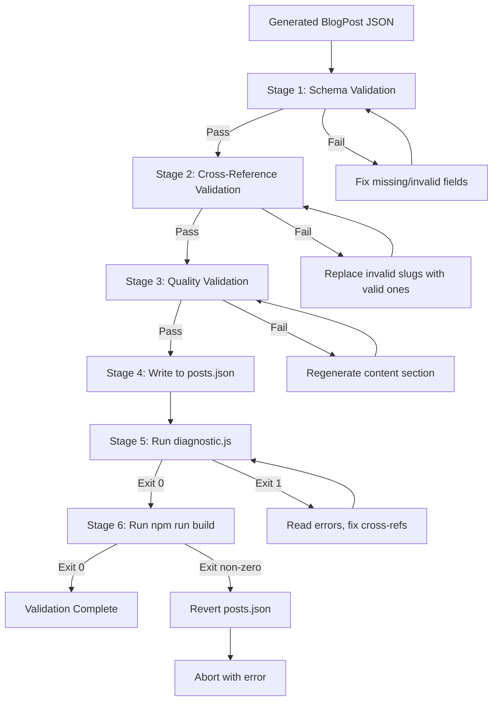

# Technical Design: Automated Weekly Blog Pipeline

**Feature:** Autonomous Content Engine for libertyvillage.co
**PRD:** [prd-auto-blog-pipeline.md](./prd-auto-blog-pipeline.md)
**Date:** February 8, 2026
**Status:** Draft

---

## 1. Overview

### 1.1 Purpose

This document specifies the technical design for an automated weekly blog pipeline that publishes one SEO-optimized blog post per week to libertyvillage.co without human intervention. The system runs every Sunday via GitHub Actions, uses the Claude Agent SDK to orchestrate a multi-step workflow, collects real SEO data from Google Search Console and Google Analytics 4 via MCP servers, generates a complete blog post, sources a hero image, validates the output, and commits to `main` for Vercel auto-deploy.

### 1.2 Business Value

- Consistent weekly publishing cadence (52 posts/year) to build SEO authority
- Data-driven topic selection using real GSC/GA4 performance metrics
- Zero manual effort after initial setup -- fully autonomous operation
- Cost-controlled at under $2.00 USD per run ($8/month)

### 1.3 Key Architectural Decisions

| Decision | Choice | Rationale |
|----------|--------|-----------|
| Orchestration | Claude Agent SDK (`@anthropic-ai/claude-agent-sdk`) | Native tool execution, MCP support, cost tracking, budget cap |
| Model | `claude-sonnet-4-5` | Best cost/quality balance for content generation within $2 budget |
| SEO data | MCP servers (GSC + GA4) | Agent can query data naturally via tool calls, no custom API code |
| Image source | Pixabay API with branded card fallback | Free tier, horizontal photos, no attribution required when downloaded |
| Runtime | GitHub Actions cron | Free for public repos, built-in secrets management, ephemeral containers |
| Deployment | Git push to `main` triggers Vercel auto-deploy | Zero-config deployment, already configured for the site |

### 1.4 Implementation Timeline

| Phase | Scope | Duration |
|-------|-------|----------|
| Phase 1 | Foundation: workflow file, orchestrator script, credential handler, Pixabay module | Week 1 |
| Phase 2 | Prompt engineering: SEO collection, topic selection, post generation prompts | Week 1 |
| Phase 3 | Integration: system prompt assembly, branded fallback, validation pipeline | Week 2 |
| Phase 4 | Observability: run logging, quality guards, manual override | Week 2 |
| Testing | Dry-run testing with manual review | Week 3 |
| Launch | Full autopilot with monitoring | Week 4+ |

---

## 2. Architecture

### 2.1 System Architecture Diagram



### 2.2 Component Overview

| Component | File Path | Responsibility |
|-----------|-----------|----------------|
| GitHub Actions Workflow | `.github/workflows/weekly-blog.yml` | Cron scheduling, environment setup, secret injection, git commit/push |
| Agent Orchestrator | `scripts/weekly-blog-agent.js` | Initialize Agent SDK, configure MCP servers, stream messages, handle results |
| Credential Handler | Inline in workflow YAML + orchestrator | Write `GOOGLE_SERVICE_ACCOUNT_JSON` to temp file, set env vars, cleanup |
| Pixabay Module | `lib/pixabay.js` | Search and download stock photos from Pixabay API |
| System Prompt | `scripts/prompts/weekly-blog-system.md` | Full pipeline instructions for the agent |
| Run Logger | Inline in orchestrator | Write run logs to `tasks/auto-blog-runs/{date}.json` |

### 2.3 Data Flow



---

## 3. Components and Interfaces

### 3.1 GitHub Actions Workflow

**File:** `.github/workflows/weekly-blog.yml`

```yaml
name: Weekly Blog Post
on:
  schedule:
    - cron: '0 11 * * 0'  # Sunday 11:00 UTC (6am ET)
  workflow_dispatch:
    inputs:
      topic_override:
        description: 'Force a specific topic (skips SEO analysis)'
        required: false
        type: string
      dry_run:
        description: 'Run without committing'
        required: false
        type: boolean
        default: false

jobs:
  publish-blog:
    runs-on: ubuntu-latest
    timeout-minutes: 15
    steps:
      - uses: actions/checkout@v4

      - uses: actions/setup-node@v4
        with:
          node-version: '20'

      - name: Install dependencies
        run: |
          npm ci
          npm install @anthropic-ai/claude-agent-sdk mcp-server-gsc mcp-server-google-analytics
          npx playwright install chromium

      - name: Write Google credentials
        run: |
          echo '${{ secrets.GOOGLE_SERVICE_ACCOUNT_JSON }}' > /tmp/gsa-credentials.json

      - name: Run blog pipeline
        env:
          ANTHROPIC_API_KEY: ${{ secrets.ANTHROPIC_API_KEY }}
          GOOGLE_APPLICATION_CREDENTIALS: /tmp/gsa-credentials.json
          GOOGLE_SERVICE_ACCOUNT_JSON: ${{ secrets.GOOGLE_SERVICE_ACCOUNT_JSON }}
          PIXABAY_API_KEY: ${{ secrets.PIXABAY_API_KEY }}
          TOPIC_OVERRIDE: ${{ inputs.topic_override }}
          DRY_RUN: ${{ inputs.dry_run }}
        run: node scripts/weekly-blog-agent.js

      - name: Cleanup credentials
        if: always()
        run: rm -f /tmp/gsa-credentials.json

      - name: Commit and push
        if: success() && inputs.dry_run != 'true'
        run: |
          git config user.name "LV Content Bot"
          git config user.email "noreply@libertyvillage.co"
          git add data/posts.json public/images/blog/ tasks/seo-data-latest.json tasks/auto-blog-runs/
          git diff --cached --quiet && echo "No changes to commit" && exit 0
          git commit -m "blog: auto-publish $(date +%Y-%m-%d) - $(node -e \"const p=require('./data/posts.json'); console.log(p[p.length-1].title)\")"
          git push
```

**Key design decisions:**
- `npm ci` installs the existing site dependencies, then the three pipeline-specific packages are installed on top. This avoids modifying the committed `package.json`.
- Credentials are written to `/tmp` and cleaned up in an `always()` step.
- The commit step only runs on success and when `dry_run` is not true.
- The commit message includes the date and the new post title for easy identification.

### 3.2 Agent SDK Orchestrator

**File:** `scripts/weekly-blog-agent.js`

```javascript
#!/usr/bin/env node
const { query } = require("@anthropic-ai/claude-agent-sdk");
const fs = require("fs");
const path = require("path");

const CWD = path.resolve(__dirname, "..");

// Parse Google service account credentials for GA4 MCP server
const saJson = process.env.GOOGLE_SERVICE_ACCOUNT_JSON
  ? JSON.parse(process.env.GOOGLE_SERVICE_ACCOUNT_JSON)
  : null;

// Build the system prompt
const systemPromptPath = path.join(CWD, "scripts/prompts/weekly-blog-system.md");
const systemPrompt = fs.readFileSync(systemPromptPath, "utf-8");

// Build the user prompt (may include topic override)
const topicOverride = process.env.TOPIC_OVERRIDE || "";
const dryRun = process.env.DRY_RUN === "true";

let userPrompt = "Execute the weekly blog pipeline now.";
if (topicOverride) {
  userPrompt += ` TOPIC OVERRIDE: Skip SEO analysis and topic selection. Use this topic: "${topicOverride}"`;
}
if (dryRun) {
  userPrompt += " DRY RUN MODE: Do NOT modify data/posts.json. Write the generated post to tasks/auto-blog-dry-run.json instead.";
}

async function main() {
  const startTime = Date.now();
  let result = null;

  for await (const message of query({
    prompt: userPrompt,
    options: {
      systemPrompt,
      model: "claude-sonnet-4-5",
      cwd: CWD,
      maxTurns: 50,
      maxBudgetUsd: 2.0,
      permissionMode: "bypassPermissions",
      allowDangerouslySkipPermissions: true,
      settingSources: ["project"],
      mcpServers: {
        gsc: {
          command: "npx",
          args: ["-y", "mcp-server-gsc"],
          env: {
            GOOGLE_APPLICATION_CREDENTIALS: process.env.GOOGLE_APPLICATION_CREDENTIALS
          }
        },
        ga4: {
          command: "npx",
          args: ["-y", "mcp-server-google-analytics"],
          env: {
            GOOGLE_CLIENT_EMAIL: saJson?.client_email || "",
            GOOGLE_PRIVATE_KEY: saJson?.private_key || "",
            GA_PROPERTY_ID: process.env.GA_PROPERTY_ID || ""
          }
        }
      },
      allowedTools: [
        "Read", "Write", "Edit", "Bash", "Glob", "Grep",
        "mcp__gsc__*",
        "mcp__ga4__*"
      ]
    }
  })) {
    // Log progress
    if (message.type === "system" && message.subtype === "init") {
      console.log("[INIT] MCP servers:", JSON.stringify(message.mcp_servers));
      console.log("[INIT] Model:", message.model);
    }

    if (message.type === "assistant" && message.message?.content) {
      for (const block of message.message.content) {
        if ("text" in block) {
          // Log first 200 chars of reasoning
          const preview = block.text.substring(0, 200);
          console.log(`[AGENT] ${preview}${block.text.length > 200 ? "..." : ""}`);
        } else if ("name" in block) {
          console.log(`[TOOL] ${block.name}`);
        }
      }
    }

    if (message.type === "result") {
      result = message;
    }
  }

  // Process result
  const duration_ms = Date.now() - startTime;
  const runLog = buildRunLog(result, duration_ms);

  // Write run log
  const logsDir = path.join(CWD, "tasks/auto-blog-runs");
  fs.mkdirSync(logsDir, { recursive: true });
  const logFile = path.join(logsDir, `${new Date().toISOString().split("T")[0]}.json`);
  fs.writeFileSync(logFile, JSON.stringify(runLog, null, 2));

  // Write GitHub Actions summary
  if (process.env.GITHUB_STEP_SUMMARY) {
    const summary = [
      `## Weekly Blog Pipeline`,
      `- **Status:** ${result?.subtype === "success" ? "Success" : "Failed"}`,
      `- **Cost:** $${runLog.costUsd.toFixed(4)}`,
      `- **Turns:** ${runLog.turnsUsed}`,
      `- **Duration:** ${(duration_ms / 1000).toFixed(0)}s`,
      runLog.postSlug ? `- **Post:** ${runLog.postSlug}` : "",
      runLog.errors.length > 0 ? `- **Errors:** ${runLog.errors.join(", ")}` : "",
    ].filter(Boolean).join("\n");
    fs.appendFileSync(process.env.GITHUB_STEP_SUMMARY, summary);
  }

  // Exit code
  if (result?.subtype !== "success") {
    console.error(`[FAIL] Pipeline ended with: ${result?.subtype}`);
    if (result?.errors) console.error("[ERRORS]", result.errors);
    process.exit(1);
  }

  console.log(`[DONE] Cost: $${runLog.costUsd.toFixed(4)}, Turns: ${runLog.turnsUsed}`);
  process.exit(0);
}

function buildRunLog(result, duration_ms) {
  return {
    date: new Date().toISOString(),
    success: result?.subtype === "success",
    costUsd: result?.total_cost_usd ?? 0,
    turnsUsed: result?.num_turns ?? 0,
    topicSelected: "", // Extracted from result text by grep
    postSlug: "",      // Extracted from result text by grep
    seoDataSummary: "",
    errors: result?.errors ?? [],
    duration_ms,
    modelUsage: result?.modelUsage ?? {}
  };
}

main().catch((err) => {
  console.error("[FATAL]", err);
  process.exit(1);
});
```

### 3.3 Agent SDK Configuration (Exact Specification)

```typescript
// TypeScript type reference for the options object
const options: Options = {
  // System prompt loaded from file
  systemPrompt: string,  // Contents of scripts/prompts/weekly-blog-system.md

  // Model and limits
  model: "claude-sonnet-4-5",
  maxTurns: 50,                    // Safety limit on conversation turns
  maxBudgetUsd: 2.0,              // Hard cost cap per run

  // Working directory
  cwd: "/path/to/libertyvillage",  // Repo root

  // Permission mode (CI-safe)
  permissionMode: "bypassPermissions",
  allowDangerouslySkipPermissions: true,

  // Load CLAUDE.md for project context
  settingSources: ["project"],

  // MCP server configurations
  mcpServers: {
    gsc: McpStdioServerConfig,     // See Section 3.4
    ga4: McpStdioServerConfig      // See Section 3.4
  },

  // Tool whitelist (explicit for security)
  allowedTools: [
    "Read", "Write", "Edit", "Bash", "Glob", "Grep",
    "mcp__gsc__*",                 // All GSC tools
    "mcp__ga4__*"                  // All GA4 tools
  ]
};
```

**Design rationale for key options:**

- **`maxTurns: 50`** -- The pipeline has 6 major steps, each requiring 3-8 tool calls. 50 turns provides comfortable headroom for retries without allowing runaway execution.
- **`maxBudgetUsd: 2.0`** -- Estimated cost per run is $0.50-$1.20 (see Section 11). The $2.00 cap provides 60-300% headroom for retries and edge cases.
- **`permissionMode: "bypassPermissions"`** -- Required for unattended CI execution. Safety is maintained by the ephemeral container, tool whitelist, and budget cap.
- **`settingSources: ["project"]`** -- Loads the project's CLAUDE.md file, which contains critical context about the codebase structure, data file locations, and coding conventions.

### 3.4 MCP Server Configuration

#### Google Search Console (`mcp-server-gsc` v0.2.1)

```javascript
{
  gsc: {
    command: "npx",
    args: ["-y", "mcp-server-gsc"],
    env: {
      GOOGLE_APPLICATION_CREDENTIALS: "/tmp/gsa-credentials.json"
    }
  }
}
```

**Available tools:**

| Tool | Description | Key Parameters |
|------|-------------|----------------|
| `mcp__gsc__search_analytics` | Search performance data | `siteUrl`, `startDate`, `endDate`, `dimensions`, `rowLimit`, `detectQuickWins`, `quickWinsConfig` |

**Agent usage pattern -- standard analytics:**
```
siteUrl: "sc-domain:libertyvillage.co"
startDate: "{7 days ago, YYYY-MM-DD}"
endDate: "{today, YYYY-MM-DD}"
dimensions: "query,page"
rowLimit: 5000
```

**Agent usage pattern -- quick wins detection:**
```
siteUrl: "sc-domain:libertyvillage.co"
startDate: "{28 days ago, YYYY-MM-DD}"
endDate: "{today, YYYY-MM-DD}"
dimensions: "query,page"
detectQuickWins: true
quickWinsConfig: { positionRange: [4, 20], minImpressions: 50, minCtr: 1 }
```

#### Google Analytics 4 (`mcp-server-google-analytics`)

```javascript
{
  ga4: {
    command: "npx",
    args: ["-y", "mcp-server-google-analytics"],
    env: {
      GOOGLE_CLIENT_EMAIL: "<extracted from SA JSON>",
      GOOGLE_PRIVATE_KEY: "<extracted from SA JSON>",
      GA_PROPERTY_ID: "<GA4 property ID>"
    }
  }
}
```

**Available tools:**

| Tool | Description | Key Parameters |
|------|-------------|----------------|
| `mcp__ga4__runReport` | Flexible analytics queries | `startDate`, `endDate`, `dimensions[]`, `metrics[]`, `dimensionFilter` |
| `mcp__ga4__getPageViews` | Page view metrics | `startDate`, `endDate`, `dimensions` |
| `mcp__ga4__getActiveUsers` | Active user counts | `startDate`, `endDate` |
| `mcp__ga4__getEvents` | Event analytics | `startDate`, `endDate`, `eventName` |
| `mcp__ga4__getUserBehavior` | Sessions, bounce rate | `startDate`, `endDate` |

**Agent usage patterns:**
- Page views by path: `getPageViews({ startDate: "7daysAgo", endDate: "today", dimensions: "page" })`
- Engagement metrics: `getUserBehavior({ startDate: "7daysAgo", endDate: "today" })`
- Session data: `getActiveUsers({ startDate: "7daysAgo", endDate: "today" })`

### 3.5 Pixabay Image Service Module

**File:** `lib/pixabay.js`

```javascript
#!/usr/bin/env node
const https = require("https");
const fs = require("fs");

const PIXABAY_BASE = "https://pixabay.com/api/";

/**
 * Search Pixabay for a photo and download the top result.
 * @param {string} searchQuery - Search terms (e.g., "toronto neighbourhood cafe")
 * @param {string} outputPath - Absolute path for downloaded image
 * @returns {Promise<boolean>} - true if image downloaded and >10KB
 */
async function searchAndDownload(searchQuery, outputPath) {
  const apiKey = process.env.PIXABAY_API_KEY;
  if (!apiKey) {
    console.error("[pixabay] PIXABAY_API_KEY not set");
    return false;
  }

  const params = new URLSearchParams({
    key: apiKey,
    q: searchQuery,
    image_type: "photo",
    orientation: "horizontal",
    min_width: "1280",
    safesearch: "true",
    per_page: "5"
  });

  try {
    const data = await httpGet(`${PIXABAY_BASE}?${params}`);
    const json = JSON.parse(data);

    if (!json.hits || json.hits.length === 0) {
      console.log("[pixabay] No results for:", searchQuery);
      return false;
    }

    const imageUrl = json.hits[0].largeImageURL;
    await downloadFile(imageUrl, outputPath);

    const stats = fs.statSync(outputPath);
    if (stats.size < 10240) {
      console.log(`[pixabay] Image too small (${stats.size} bytes)`);
      fs.unlinkSync(outputPath);
      return false;
    }

    console.log(`[pixabay] Downloaded ${(stats.size / 1024).toFixed(0)}KB`);
    return true;
  } catch (err) {
    console.error("[pixabay] Error:", err.message);
    return false;
  }
}

function httpGet(url) { /* HTTPS GET returning promise of body string */ }
function downloadFile(url, dest) { /* HTTPS download to file with redirect handling */ }

module.exports = { searchAndDownload };
```

**API specification:**

| Parameter | Value | Rationale |
|-----------|-------|-----------|
| `image_type` | `photo` | Real photographs, not illustrations or vectors |
| `orientation` | `horizontal` | Hero images are 1280x720 landscape format |
| `min_width` | `1280` | Ensures sufficient resolution for hero display |
| `safesearch` | `true` | Ensures appropriate content |
| `per_page` | `5` | Small result set since we only use the top hit |

**Rate limit handling:**
- Pixabay allows 100 requests per minute per API key
- The pipeline makes at most 2-3 requests per run (search + possible retry with different query)
- No explicit rate limiting needed, but the module includes retry with exponential backoff for HTTP 429 responses

### 3.6 System Prompt Design

**File:** `scripts/prompts/weekly-blog-system.md`

The system prompt is the core intelligence of the pipeline. It instructs the agent on exactly what to do, in what order, with what constraints. The prompt is structured as follows:

```
# Weekly Blog Pipeline - System Prompt

## Role
You are the content automation agent for libertyvillage.co...

## Context
- Site: Next.js 16 static site, 179 pages, pure SEO focus
- Domain: libertyvillage.co
- Data files: data/posts.json, data/services.json, data/topics.json, data/businesses.json
- Current post count: {dynamically referenced via Read}
- BlogPost interface: {TypeScript interface inlined}

## Pipeline Steps

### Step 1: Collect SEO Data
- Use mcp__gsc__search_analytics for last 7 days...
- Use mcp__ga4__getPageViews and getUserBehavior...
- Save raw data to tasks/seo-data-latest.json
- Produce analysis summary

### Step 2: Select Topic
- Read all data files to understand existing content
- Identify content gaps from SEO data
- Apply selection criteria (diversity, recency, cross-ref potential)
- Verify no duplicate slugs or topics
- Output: topic, title, slug, keywords, category

### Step 3: Generate Blog Post
- Generate complete BlogPost JSON object
- Content: 800-1200 words markdown
- Include internal links using [text](/best/slug) and [text](/guides/slug)
- Mention real businesses by **bold name**
- All relatedServices/relatedTopics/relatedPosts must reference real slugs
- Answer block: 40-60 words
- FAQs: 4-5 questions with substantive answers (>20 words each)
- Key takeaways: 4-6 bullet points

### Step 4: Source Hero Image
- Run Pixabay search using lib/pixabay.js via Bash
- If fails: generate branded hero card using existing pattern from generate-blog-images.js
- Save to public/images/blog/{slug}.jpg

### Step 5: Validate
- Schema validation (all required fields, valid enum values)
- Append to data/posts.json
- Run: node scripts/diagnostic.js (must exit 0)
- Run: npm run build (must complete without errors)
- If either fails: fix and retry, or revert and report error

### Step 6: Report
- Output summary: topic, slug, cost, success/failure

## Quality Rules
- No duplicate topics (check existing posts)
- Content length: 800-1200 words
- At least 3 internal links
- At least 2 business bold-mentions
- Category must be one of: news, development, food-drink, events, transit, real-estate, lifestyle, community

## Error Recovery
- Pixabay failure -> branded hero card fallback
- Diagnostic failure -> fix cross-references, retry (max 2 attempts)
- Build failure -> revert posts.json, report error
- Budget approaching limit -> skip remaining optional steps, commit what is valid

## Files You Will Modify
- data/posts.json (append new post)
- public/images/blog/{slug}.jpg (new image)
- tasks/seo-data-latest.json (SEO data snapshot)
```

**Design decisions:**
- The BlogPost TypeScript interface is inlined directly in the prompt so the agent always has the exact schema reference
- Step numbers create a clear sequential flow while allowing the agent flexibility in how it executes each step
- Quality rules are stated as hard constraints with specific numbers (not vague guidance)
- Error recovery is prescriptive -- the agent knows exactly what to do when things fail
- The file modification list is explicit so the agent does not accidentally modify other files

---

## 4. Data Models

### 4.1 BlogPost Interface (Existing)

Reference: `/workspace/libertyvillage/lib/types.ts`

```typescript
export interface BlogPost {
  slug: string;                    // URL-safe identifier, e.g., "weekend-brunch-guide-liberty-village"
  title: string;                   // Display title, e.g., "Weekend Brunch Guide to Liberty Village"
  description: string;             // Meta description, 150-160 characters
  content: string;                 // Markdown body, 800-1200 words
  publishedAt: string;             // ISO date string, e.g., "2026-02-09"
  updatedAt: string;               // ISO date string, same as publishedAt for new posts
  category:                        // Must be one of these exact values:
    | "news"
    | "development"
    | "food-drink"
    | "events"
    | "transit"
    | "real-estate"
    | "lifestyle"
    | "community";
  tags: string[];                  // 4-6 lowercase-hyphenated tags
  answerBlock: string;             // AEO answer, 40-60 words
  faqs: FAQ[];                     // 4-5 FAQ objects
  image?: string;                  // Path: "/images/blog/{slug}.jpg"
  relatedServices: string[];       // 2-3 slugs from services.json (59 available)
  relatedTopics: string[];         // 2-3 slugs from topics.json (30 available)
  relatedPosts: string[];          // 1-2 slugs from posts.json (11+ available)
  keyTakeaways: string[];          // 4-6 bullet-point strings
  author: string;                  // "LibertyVillage.co"
}

export interface FAQ {
  question: string;                // Full question ending with "?"
  answer: string;                  // Substantive answer, >20 words
}
```

**Note on `author` field:** The PRD specifies an author object with `name`, `role`, `avatar`, but the existing TypeScript interface and all 11 current posts use a simple string (`"LibertyVillage.co"`). The design follows the existing interface to maintain compatibility.

### 4.2 SEO Data Schema

**File:** `tasks/seo-data-latest.json`

```typescript
interface SEODataSnapshot {
  collectedAt: string;             // ISO timestamp
  gsc: {
    searchAnalytics: {
      rows: Array<{
        keys: string[];            // [query, page]
        clicks: number;
        impressions: number;
        ctr: number;
        position: number;
      }>;
      totalRows: number;
      dateRange: { start: string; end: string };
    };
    quickWins: Array<{
      query: string;
      page: string;
      impressions: number;
      clicks: number;
      ctr: number;
      position: number;
    }>;
  };
  ga4: {
    pageViews: Array<{
      pagePath: string;
      pageViews: number;
    }>;
    behavior: {
      sessions: number;
      bounceRate: number;
      avgSessionDuration: number;
    };
  };
  analysis: {
    topQueries: string[];          // Top 10 queries by impressions
    contentGaps: string[];         // Queries with impressions but no page
    trendingTopics: string[];      // New queries this week
    underperforming: string[];     // Pages with high impressions, low CTR
  };
}
```

This file is overwritten each run. It serves as both a debugging artifact and input for the topic selection step.

### 4.3 Run Log Schema

**File:** `tasks/auto-blog-runs/{YYYY-MM-DD}.json`

```typescript
interface RunLog {
  date: string;                    // ISO timestamp
  success: boolean;                // Whether pipeline completed successfully
  costUsd: number;                 // Total API cost from SDK result
  turnsUsed: number;               // Number of agent turns consumed
  topicSelected: string;           // Chosen topic description
  postSlug: string;                // Generated post slug (empty if failed)
  seoDataSummary: string;          // Brief summary of SEO findings
  errors: string[];                // Error messages (empty if successful)
  duration_ms: number;             // Total runtime in milliseconds
  modelUsage: {                    // Per-model token breakdown
    [modelName: string]: {
      inputTokens: number;
      outputTokens: number;
      cacheReadInputTokens: number;
      cacheCreationInputTokens: number;
      costUSD: number;
    };
  };
}
```

### 4.4 Dry Run Output Schema

**File:** `tasks/auto-blog-dry-run.json`

When `DRY_RUN=true`, the agent writes the generated BlogPost object to this file instead of appending to `posts.json`. The schema matches the `BlogPost` interface exactly.

---

## 5. Error Handling

### 5.1 Error Classification and Recovery Matrix

| Error Type | Detection | Recovery Strategy | Max Retries |
|------------|-----------|-------------------|-------------|
| MCP server connection failure (GSC) | `init` message shows `status !== "connected"` | Log warning; if GSC fails, skip SEO data collection and use topic override or heuristic selection | 0 (fail gracefully) |
| MCP server connection failure (GA4) | `init` message shows `status !== "connected"` | Log warning; proceed without GA4 data; GSC data alone is sufficient for topic selection | 0 (fail gracefully) |
| Pixabay API failure (429/5xx/timeout) | HTTP status code or network error | Retry with exponential backoff (1s, 2s, 4s); after 3 failures, fall back to branded hero card | 3 |
| Pixabay no results | `hits.length === 0` or image < 10KB | Try alternative search query (broader terms); if still fails, branded hero card | 1 |
| Blog post validation failure | Schema check in agent logic | Agent adjusts the post JSON and retries validation | 2 |
| Cross-reference validation failure | `diagnostic.js` exits with code 1 | Agent reads error output, fixes invalid slugs, re-runs diagnostic | 2 |
| Build failure | `npm run build` exits non-zero | Agent reverts `data/posts.json` to original, logs error, exits with failure | 0 (abort) |
| Budget exceeded | SDK returns `error_max_budget_usd` result | Orchestrator logs the cost, writes run log with failure, exits with code 1 | 0 (hard limit) |
| Max turns exceeded | SDK returns `error_max_turns` result | Orchestrator logs turn count, writes run log with failure, exits with code 1 | 0 (hard limit) |
| Agent execution error | SDK returns `error_during_execution` result | Orchestrator logs errors array, writes run log with failure, exits with code 1 | 0 |
| Anthropic API error (5xx/rate limit) | SDK handles internally with retries | SDK has built-in retry logic; if exhausted, returns `error_during_execution` | SDK-managed |

### 5.2 Orchestrator Error Handling Flow



### 5.3 Agent-Level Error Recovery (Inside the System Prompt)

The agent itself handles recoverable errors within its turn budget:

1. **Diagnostic failure:** Read the error output from `diagnostic.js`, identify which cross-references are invalid, fix them by replacing with valid slugs from the data files, re-run diagnostic.
2. **Content quality failure:** If word count is below 800 or above 1200, regenerate the content section. If internal links are missing, add them. If business mentions are missing, add bold-name references to businesses from `businesses.json`.
3. **Image failure cascade:** Try Pixabay search -> try alternative query -> render branded hero card via Playwright. Each fallback is a separate tool call.
4. **Build failure (non-recoverable):** The agent reverts `data/posts.json` to its state before the pipeline modified it (reads the original content at the start and stores it), reports the build error, and exits.

---

## 6. Security Model

### 6.1 Credential Flow

```mermaid
flowchart LR
    subgraph "GitHub Secrets (encrypted at rest)"
        S1[ANTHROPIC_API_KEY]
        S2[GOOGLE_SERVICE_ACCOUNT_JSON]
        S3[PIXABAY_API_KEY]
    end

    subgraph "GitHub Actions Runner (ephemeral)"
        ENV[Process Environment]
        TMPFILE[/tmp/gsa-credentials.json]

        subgraph "Agent SDK Process"
            AGENT[Claude Agent]
            MCP_GSC[GSC MCP Server]
            MCP_GA4[GA4 MCP Server]
        end
    end

    S1 -->|injected as env var| ENV
    S2 -->|written to temp file| TMPFILE
    S2 -->|parsed for client_email/private_key| ENV
    S3 -->|injected as env var| ENV

    ENV -->|ANTHROPIC_API_KEY| AGENT
    TMPFILE -->|GOOGLE_APPLICATION_CREDENTIALS| MCP_GSC
    ENV -->|GOOGLE_CLIENT_EMAIL, GOOGLE_PRIVATE_KEY| MCP_GA4
    ENV -->|PIXABAY_API_KEY| AGENT
```

### 6.2 Security Boundaries

| Boundary | Mechanism | Risk Mitigation |
|----------|-----------|-----------------|
| **API cost** | `maxBudgetUsd: 2.0` in Agent SDK | Hard cap enforced by SDK; cannot be overridden by agent |
| **Execution scope** | `maxTurns: 50` | Prevents runaway loops; pipeline typically needs 20-35 turns |
| **Tool access** | Explicit `allowedTools` whitelist | Agent cannot use WebFetch, WebSearch, or any tool not listed |
| **File system** | `cwd` set to repo root; agent has full read/write within repo | Acceptable risk -- ephemeral container is destroyed after run |
| **Network access** | MCP servers + Pixabay only | Agent cannot make arbitrary HTTP requests (no WebFetch tool) |
| **Credential exposure** | Temp file deleted in `always()` step; credentials never logged | SA JSON never appears in agent output or committed files |
| **Container isolation** | GitHub Actions Ubuntu runner; destroyed after job | No persistent access; no secrets persist after run |
| **Git scope** | `git add` only adds specific files | Agent modifications to other files are not committed |

### 6.3 Permission Mode Justification

The pipeline uses `permissionMode: "bypassPermissions"` which is the most permissive mode. This is justified because:

1. **No interactive user** -- The pipeline runs in CI with no human to approve tool calls
2. **Ephemeral environment** -- The GitHub Actions runner is created fresh for each run and destroyed after
3. **Budget cap** -- The $2.00 hard limit prevents cost runaway regardless of agent behavior
4. **Tool whitelist** -- Only 8 built-in tools + 2 MCP server wildcards are allowed
5. **Git commit scope** -- Only specific files are staged; the agent cannot force-push or modify branches
6. **Turn limit** -- 50 turns is a hard ceiling that the SDK enforces

### 6.4 Required Google Cloud Setup

The following must be configured before the pipeline can run:

1. **Google Cloud Project** with the following APIs enabled:
   - Search Console API
   - Google Analytics Data API v1

2. **Service Account** created in the project with:
   - No special IAM roles needed at project level
   - JSON key downloaded and stored as `GOOGLE_SERVICE_ACCOUNT_JSON` GitHub secret

3. **Google Search Console** property (`sc-domain:libertyvillage.co`):
   - Service account email added as property user (Full permission)

4. **Google Analytics 4** property:
   - Service account email added with Viewer role
   - `GA_PROPERTY_ID` stored as GitHub secret or environment variable

---

## 7. File Structure

### 7.1 New Files to Create

```
libertyvillage/
  .github/
    workflows/
      weekly-blog.yml                    # GitHub Actions workflow
  scripts/
    weekly-blog-agent.js                 # Agent SDK orchestrator
    prompts/
      weekly-blog-system.md              # System prompt for the agent
  lib/
    pixabay.js                           # Pixabay search + download module
  tasks/
    auto-blog-runs/                      # Directory for run logs
      .gitkeep                           # Ensure directory exists in repo
```

### 7.2 Files Modified Each Run

```
data/posts.json                          # New post appended to array
public/images/blog/{slug}.jpg            # New hero image
tasks/seo-data-latest.json              # Overwritten with latest SEO data
tasks/auto-blog-runs/{date}.json        # New run log created
```

### 7.3 Files Modified Only on Dry Run

```
tasks/auto-blog-dry-run.json            # Generated post (not committed)
tasks/seo-data-latest.json              # Still written
tasks/auto-blog-runs/{date}.json        # Still written
```

### 7.4 Existing Files Referenced (Read-Only)

```
data/services.json                       # 59 service slugs for cross-references
data/topics.json                         # 30 topic slugs for cross-references
data/businesses.json                     # 68 business names for mentions
data/posts.json                          # Existing posts for duplicate check
lib/types.ts                             # BlogPost interface reference
scripts/diagnostic.js                    # Validation script
scripts/generate-blog-images.js          # Branded hero card pattern reference
```

---

## 8. API Specifications

### 8.1 Pixabay Image Search API

**Endpoint:** `GET https://pixabay.com/api/`

**Request:**

| Parameter | Type | Value | Required |
|-----------|------|-------|----------|
| `key` | string | `process.env.PIXABAY_API_KEY` | Yes |
| `q` | string | URL-encoded search query, max 100 chars | Yes |
| `image_type` | string | `"photo"` | Yes |
| `orientation` | string | `"horizontal"` | Yes |
| `min_width` | integer | `1280` | Yes |
| `safesearch` | boolean | `true` | Yes |
| `per_page` | integer | `5` | No (default 20) |

**Response (relevant fields):**

```json
{
  "total": 12345,
  "totalHits": 500,
  "hits": [
    {
      "id": 195893,
      "largeImageURL": "https://pixabay.com/get/..._1280.jpg",
      "imageWidth": 1920,
      "imageHeight": 1280,
      "imageSize": 812345,
      "tags": "toronto, city, urban",
      "user": "photographer_name"
    }
  ]
}
```

**Usage in pipeline:**
1. Agent constructs a search query based on the blog topic (e.g., `"toronto neighbourhood cafe cozy"`)
2. Agent calls `lib/pixabay.js` via Bash: `node -e "require('./lib/pixabay').searchAndDownload('query', 'public/images/blog/slug.jpg').then(ok => process.exit(ok ? 0 : 1))"`
3. If exit code is 0, image is ready. If 1, agent falls back to branded hero card.

**Rate limits:**
- 100 requests per 60 seconds
- Response headers: `X-RateLimit-Limit`, `X-RateLimit-Remaining`, `X-RateLimit-Reset`
- Pipeline uses 1-3 requests per run, well within limits

### 8.2 GSC MCP Tool Usage Patterns

The agent calls GSC tools through MCP using the tool name `mcp__gsc__search_analytics`.

**Pattern 1: Weekly Performance Overview**
```json
{
  "siteUrl": "sc-domain:libertyvillage.co",
  "startDate": "2026-02-01",
  "endDate": "2026-02-08",
  "dimensions": "query,page",
  "rowLimit": 5000,
  "dataState": "all"
}
```
Returns top queries and pages with impressions, clicks, CTR, and position.

**Pattern 2: Quick Wins Detection**
```json
{
  "siteUrl": "sc-domain:libertyvillage.co",
  "startDate": "2026-01-11",
  "endDate": "2026-02-08",
  "dimensions": "query,page",
  "detectQuickWins": true,
  "quickWinsConfig": {
    "positionRange": [4, 20],
    "minImpressions": 50,
    "minCtr": 1
  }
}
```
Returns queries where the site ranks on page 1-2 but has low CTR, indicating optimization opportunities.

### 8.3 GA4 MCP Tool Usage Patterns

**Pattern 1: Page Views by Path**
Tool: `mcp__ga4__getPageViews`
```json
{
  "startDate": "7daysAgo",
  "endDate": "today",
  "dimensions": "page"
}
```

**Pattern 2: User Behavior Metrics**
Tool: `mcp__ga4__getUserBehavior`
```json
{
  "startDate": "7daysAgo",
  "endDate": "today"
}
```

**Pattern 3: Active Users**
Tool: `mcp__ga4__getActiveUsers`
```json
{
  "startDate": "7daysAgo",
  "endDate": "today"
}
```

---

## 9. Validation Pipeline

### 9.1 Validation Stages

The validation pipeline runs in sequence. Each stage must pass before proceeding to the next.



### 9.2 Stage Details

**Stage 1: Schema Validation (agent-internal)**

The agent validates the generated BlogPost JSON against these rules before writing to disk:

| Field | Validation Rule |
|-------|----------------|
| `slug` | Non-empty, lowercase, alphanumeric + hyphens only, not already in posts.json |
| `title` | Non-empty, 10-100 characters |
| `description` | Non-empty, 100-200 characters |
| `content` | 800-1200 words (split by whitespace, count) |
| `publishedAt` | Valid ISO date string (YYYY-MM-DD format) |
| `updatedAt` | Valid ISO date string, same as publishedAt |
| `category` | One of the 8 valid enum values |
| `tags` | Array of 4-6 strings |
| `answerBlock` | 40-60 words |
| `faqs` | Array of 4-5 objects, each with question (ends with ?) and answer (>20 words) |
| `image` | Matches pattern `/images/blog/{slug}.jpg` |
| `relatedServices` | Array of 2-3 strings, each exists in services.json |
| `relatedTopics` | Array of 2-3 strings, each exists in topics.json |
| `relatedPosts` | Array of 1-2 strings, each exists in posts.json |
| `keyTakeaways` | Array of 4-6 strings |
| `author` | Exactly `"LibertyVillage.co"` |

**Stage 2: Cross-Reference Validation (agent-internal)**

The agent reads the data files and verifies every slug reference exists:
- `relatedServices` slugs checked against `data/services.json` (59 available)
- `relatedTopics` slugs checked against `data/topics.json` (30 available)
- `relatedPosts` slugs checked against `data/posts.json` (11+ available)

**Stage 3: Quality Validation (agent-internal)**

| Check | Threshold | Action on Failure |
|-------|-----------|-------------------|
| Word count | 800-1200 words | Regenerate content |
| Internal links | >= 3 links using `[text](/best/...)` or `[text](/guides/...)` | Add links to relevant service/guide pages |
| Business mentions | >= 2 bold mentions `**Business Name**` | Add mentions from businesses.json |
| FAQ answer length | Each > 20 words | Expand short answers |
| Answer block length | 40-60 words | Regenerate answer block |

**Stage 4: Write to posts.json**

The agent reads the existing `data/posts.json`, parses it, appends the new post object to the array, and writes it back with `JSON.stringify(posts, null, 2)` formatting.

**Stage 5: Diagnostic Script**

```bash
node scripts/diagnostic.js
```

The existing `diagnostic.js` (236 lines) checks:
- All `relatedServices` references point to valid service slugs
- All `relatedTopics` references point to valid topic slugs
- All `relatedPosts` references point to valid post slugs
- No duplicate slugs within any data file
- Required fields are present
- Business categories match service slugs

Exit code 0 = all checks passed. Exit code 1 = errors found.

**Stage 6: Next.js Build**

```bash
npm run build
```

Verifies the static site builds successfully with the new post. The build generates static pages for all blog posts including the new one. A successful build confirms:
- The new blog page renders without errors
- All `generateStaticParams()` calls resolve correctly
- No TypeScript errors in the new data

### 9.3 Committed Files Scope

Only these files are staged for git commit:

```bash
git add data/posts.json
git add public/images/blog/{slug}.jpg
git add tasks/seo-data-latest.json
git add tasks/auto-blog-runs/{date}.json
```

No other files should be committed, even if the agent modifies them during execution.

---

## 10. Testing Strategy

### 10.1 Testing Layers

| Layer | What | How | Automated? |
|-------|------|-----|------------|
| Unit | Pixabay module | Jest tests with mocked HTTP responses | Yes |
| Unit | Run log builder | Jest tests with mock SDK results | Yes |
| Integration | Orchestrator script | Dry run mode with real SDK + mock MCP data | Manual |
| Integration | System prompt | Dry run with `topic_override` to skip SEO step | Manual |
| E2E | Full pipeline | `workflow_dispatch` with `dry_run: true` | Semi-auto |
| Validation | Diagnostic script | Already exists; run against modified posts.json | Yes (part of pipeline) |
| Validation | Next.js build | Already exists; run as pipeline step | Yes (part of pipeline) |

### 10.2 Unit Tests

**File:** `scripts/__tests__/pixabay.test.js`

```javascript
// Test cases for lib/pixabay.js
describe("Pixabay searchAndDownload", () => {
  it("returns true when image is downloaded and > 10KB");
  it("returns false when no results found");
  it("returns false when image is < 10KB");
  it("returns false when API key is missing");
  it("handles HTTP 429 with retry");
  it("handles network timeout");
});
```

**File:** `scripts/__tests__/run-log.test.js`

```javascript
// Test cases for buildRunLog function
describe("buildRunLog", () => {
  it("builds success log from SDK success result");
  it("builds failure log from error_max_turns result");
  it("builds failure log from error_max_budget_usd result");
  it("handles null result gracefully");
});
```

### 10.3 Dry Run Testing

The dry run mode (`workflow_dispatch` with `dry_run: true`) provides a safe way to test the full pipeline:

1. **What runs:** The entire pipeline including SEO data collection, topic selection, and post generation
2. **What differs:** The generated post is written to `tasks/auto-blog-dry-run.json` instead of `data/posts.json`
3. **What is committed:** Nothing (the commit step is skipped)
4. **Review process:** After the run, the developer downloads `tasks/auto-blog-dry-run.json` from the GitHub Actions artifacts or checks the run log

### 10.4 Mock MCP Server Testing

For local development and testing without real Google credentials, the MCP servers can be replaced with mock implementations. This is done by creating SDK MCP servers using the `createSdkMcpServer()` function:

```javascript
const { createSdkMcpServer, tool } = require("@anthropic-ai/claude-agent-sdk");
const { z } = require("zod");

const mockGsc = createSdkMcpServer({
  name: "mock-gsc",
  tools: [
    tool(
      "search_analytics",
      "Mock GSC search analytics",
      { siteUrl: z.string(), startDate: z.string(), endDate: z.string() },
      async () => ({
        content: [{ type: "text", text: JSON.stringify(mockGscData) }]
      })
    )
  ]
});

// Use in options:
mcpServers: {
  gsc: mockGsc  // Type: McpSdkServerConfigWithInstance
}
```

This allows testing the full agent flow locally without real API credentials.

### 10.5 Testing Rollout Plan

| Week | Test Activity |
|------|--------------|
| Week 3 | Run 3 dry runs with different topic overrides; review output quality |
| Week 3 | Run 1 dry run without topic override (full SEO-driven flow); verify topic selection logic |
| Week 4 | Run 1 live run with manual review before merge (create PR instead of direct push) |
| Week 4 | If live run passes review, switch to full autopilot |
| Week 5+ | Monitor run logs and published posts weekly |

---

## 11. Cost Model

### 11.1 Token Usage Estimates per Step

These estimates are based on Claude Sonnet 4.5 pricing ($3/M input tokens, $15/M output tokens) and typical tool call patterns.

| Step | Input Tokens (est.) | Output Tokens (est.) | Est. Cost |
|------|---------------------|----------------------|-----------|
| System prompt + CLAUDE.md loading | ~8,000 | 0 | $0.024 |
| Step 1: SEO data collection (4-6 tool calls) | ~15,000 | ~3,000 | $0.090 |
| Step 2: Topic selection (4-5 file reads + analysis) | ~40,000 | ~2,000 | $0.150 |
| Step 3: Blog post generation | ~5,000 | ~4,000 | $0.075 |
| Step 4: Image sourcing (1-2 Bash calls) | ~2,000 | ~500 | $0.014 |
| Step 5: Validation (write + diagnostic + build) | ~10,000 | ~1,500 | $0.053 |
| Context re-reads and retries | ~10,000 | ~1,000 | $0.045 |
| **Total (typical run)** | **~90,000** | **~12,000** | **~$0.45** |

**Notes:**
- Step 2 is the most expensive because it reads all 4 data files (~150KB total) to understand existing content
- Cache read tokens will reduce cost significantly on subsequent turns since the system prompt and data files get cached
- Retries for validation failures can add 20-40% to the cost
- Worst case with 2 content retries + 2 validation retries: ~$1.20

### 11.2 Monthly Cost Projection

| Scenario | Runs/Month | Cost/Run | Monthly Cost |
|----------|------------|----------|--------------|
| Typical (no retries) | 4-5 | $0.45 | $1.80-$2.25 |
| With occasional retries | 4-5 | $0.70 | $2.80-$3.50 |
| Worst case (all retries) | 4-5 | $1.20 | $4.80-$6.00 |
| Hard cap | 4-5 | $2.00 | $8.00-$10.00 |

### 11.3 Cost Tracking

The Agent SDK provides exact cost tracking in the `SDKResultMessage`:

```typescript
// Available on success and error results
result.total_cost_usd    // Total cost for the entire run
result.num_turns          // Number of turns consumed
result.modelUsage         // Per-model breakdown:
  // { "claude-sonnet-4-5": { inputTokens, outputTokens, costUSD, ... } }
```

These values are captured in the run log (`tasks/auto-blog-runs/{date}.json`) for historical tracking.

---

## 12. Monitoring and Observability

### 12.1 Real-Time Monitoring (During Execution)

The orchestrator streams agent messages to stdout, which appears in the GitHub Actions log:

```
[INIT] MCP servers: [{"name":"gsc","status":"connected"},{"name":"ga4","status":"connected"}]
[INIT] Model: claude-sonnet-4-5
[AGENT] Reading existing posts to understand current content landscape...
[TOOL] mcp__gsc__search_analytics
[AGENT] GSC data collected. Top queries: "liberty village restaurants", "liberty village parking"...
[TOOL] mcp__ga4__getPageViews
[AGENT] Selecting topic based on content gap analysis...
[TOOL] Read
[TOOL] Write
[AGENT] Blog post generated. Running validation...
[TOOL] Bash
[DONE] Cost: $0.4523, Turns: 28
```

### 12.2 Post-Run Artifacts

| Artifact | Location | Retention |
|----------|----------|-----------|
| Run log | `tasks/auto-blog-runs/{date}.json` | Committed to repo (permanent) |
| SEO data snapshot | `tasks/seo-data-latest.json` | Overwritten each run |
| GitHub Actions log | GitHub UI | 90 days (GitHub default) |
| GitHub Actions step summary | Job summary tab | 90 days |
| Dry run output | `tasks/auto-blog-dry-run.json` | Not committed; overwritten each dry run |

### 12.3 GitHub Actions Step Summary

Each run writes a Markdown summary to the GitHub Actions job summary:

```markdown
## Weekly Blog Pipeline
- **Status:** Success
- **Cost:** $0.4523
- **Turns:** 28
- **Duration:** 187s
- **Post:** weekend-farmers-market-liberty-village
```

### 12.4 Failure Alerting

GitHub Actions provides built-in failure notification:

1. **Email notifications** -- GitHub sends email to repository watchers when a workflow run fails
2. **GitHub status badge** -- Can be added to README to show pipeline health
3. **Workflow run history** -- Dashboard at `https://github.com/{owner}/{repo}/actions/workflows/weekly-blog.yml`

For enhanced alerting (future phase), a Slack webhook could be added as a final step that triggers on failure.

### 12.5 Historical Analysis

The run log files accumulate in `tasks/auto-blog-runs/` and can be analyzed to track:

- **Cost trend** -- Is the pipeline getting more or less expensive over time?
- **Success rate** -- What percentage of runs succeed?
- **Turn efficiency** -- Are turns increasing as the site grows?
- **Topic diversity** -- Are topics well-distributed across categories?

---

## 13. Branded Hero Card Fallback

### 13.1 Design

When Pixabay fails to provide a suitable image, the agent generates a branded hero card using the same pattern established in `scripts/generate-blog-images.js`. The card is a 1280x720 JPEG with:

- Gradient background (color based on blog category)
- Centered emoji icon (based on category)
- Title text (wrapped to fit)
- "libertyvillage.co" branding
- Dot pattern overlay

### 13.2 Category-to-Style Mapping

| Category | Color | Icon |
|----------|-------|------|
| `news` | `#1e3a5f` (navy) | newspaper icon |
| `development` | `#525252` (grey) | building construction icon |
| `food-drink` | `#92400e` (amber) | fork and knife icon |
| `events` | `#7c2d12` (orange) | calendar icon |
| `transit` | `#374151` (slate) | train icon |
| `real-estate` | `#4338ca` (indigo) | house icon |
| `lifestyle` | `#166534` (green) | leaf icon |
| `community` | `#1e40af` (blue) | people icon |

### 13.3 Generation Method

The system prompt includes the HTML template (adapted from the existing `generateHeroHTML()` function in `scripts/generate-blog-images.js`) as a reference. The agent:

1. Creates a temporary HTML file with the branded card template
2. Launches Playwright headless Chromium
3. Sets viewport to 1280x720
4. Takes a JPEG screenshot with quality 90
5. Saves to `public/images/blog/{slug}.jpg`
6. Cleans up the temporary HTML file

This approach reuses the proven pattern from the existing codebase rather than introducing a new image generation method.

---

## 14. Duplicate and Quality Guard

### 14.1 Pre-Generation Checks

Before generating content, the agent performs these checks:

1. **Slug uniqueness:** The proposed slug does not exist in `data/posts.json`
2. **Topic uniqueness (fuzzy):** No existing post has a title or tag set that overlaps >50% with the proposed topic. The agent reads all existing post titles and tags and makes a judgment call.
3. **Category diversity:** The proposed category was not used in the last 4 posts. The agent reads the last 4 entries in `posts.json` and avoids the same category.

### 14.2 Post-Generation Quality Checks

After generation, the agent validates:

| Check | Rule | Retry Strategy |
|-------|------|----------------|
| Content length | 800-1200 words | Regenerate content section (max 2 retries) |
| Internal links | >= 3 links present | Add links to relevant pages (max 1 retry) |
| Business mentions | >= 2 bold business names | Add mentions from businesses.json (max 1 retry) |
| FAQ quality | Each answer > 20 words | Expand short answers (max 1 retry) |
| Answer block | 40-60 words | Regenerate (max 1 retry) |
| Cross-references | All slugs exist in data files | Replace invalid slugs (max 1 retry) |

### 14.3 Retry Budget

Quality retries consume agent turns and budget. The maximum retry scenario:
- 2 content regenerations + 2 validation retries = ~4 extra turns
- This adds approximately $0.30-$0.50 to the run cost
- The $2.00 budget cap provides sufficient headroom

---

## 15. Summary of Design Decisions

| # | Decision | Alternatives Considered | Rationale for Choice |
|---|----------|------------------------|---------------------|
| 1 | Single agent session (not multi-agent) | Separate agents for SEO, writing, validation | Simpler architecture; single session has full context; cost stays low |
| 2 | System prompt in Markdown file (not inline) | Inline string in JS; JSON config | Easy to review/edit; version controlled; no escaping issues |
| 3 | Pixabay over Unsplash | Unsplash Source API; AI image generation | Pixabay has reliable API with no hotlink restrictions after download; Unsplash Source was deprecated; AI generation adds cost and complexity |
| 4 | Branded card via Playwright (not Canvas/Sharp) | Node-canvas; Sharp SVG overlay | Playwright already in devDependencies; existing pattern in codebase; HTML/CSS is easier to style |
| 5 | Direct commit to main (not PR) | Create PR for review; separate staging branch | Fully autonomous operation is the goal; validation pipeline provides safety; dry run mode available for testing |
| 6 | Agent SDK over claude-code-action | `anthropics/claude-code-action@v1` | Agent SDK provides programmatic control over MCP servers, budget caps, and result handling; action is designed for PR review, not content generation |
| 7 | Run logs committed to repo (not external) | External logging service; GitHub artifacts only | Simple; searchable in repo; no additional service needed; provides historical record |
| 8 | Existing diagnostic.js for validation | New custom validator | Already comprehensive (236 lines); checks all cross-references; maintained with the site |
| 9 | `npm ci` + install pipeline deps (not committed) | Add pipeline deps to package.json | Keeps the site's package.json clean; pipeline deps are only needed in CI |
| 10 | `author` as string (not object) | Change to object per PRD | Existing interface and all 11 posts use string; changing would require migration |

---

*This design document is the definitive technical specification for the Automated Weekly Blog Pipeline. All implementation work should reference this document for architecture, interfaces, and expected behavior.*
