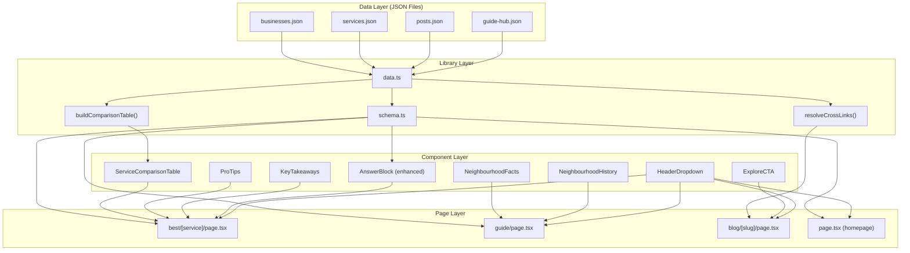
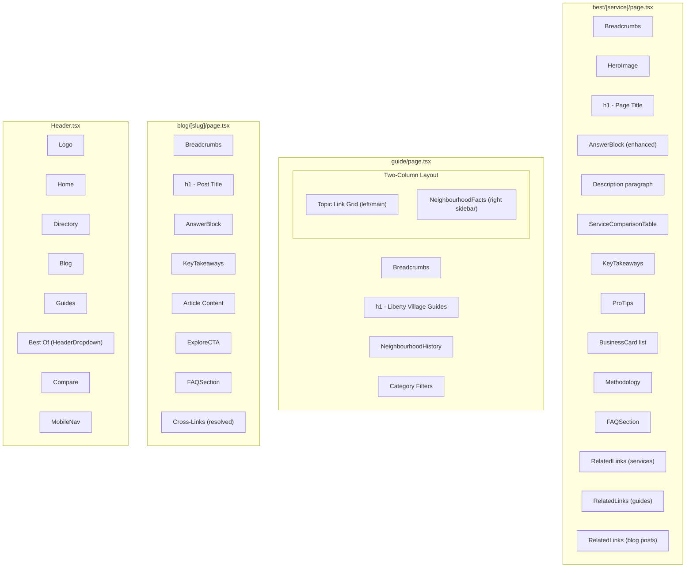

# SEO & AEO Page 1 Push -- Design Document

**Feature**: SEO & AEO Page 1 Push for libertyvillage.co
**Date**: 2026-03-29
**Status**: Draft

---

## 1. Overview

### 1.1 Purpose

This design document specifies the architectural changes needed to push libertyvillage.co toward Page 1 rankings for local Liberty Village queries and to improve Answer Engine Optimization (AEO) for AI-powered search surfaces (Google AI Overviews, ChatGPT, Perplexity, voice assistants).

The changes span six areas: data model extensions for services and posts, new UI components for richer content presentation, enhanced structured data (schema.org) for search engine and AI consumption, a redesigned guide hub page, header navigation improvements, and a cross-linking system between content types.

### 1.2 Business Value

- **SEO**: Richer page content (comparison tables, key takeaways, pro tips) increases dwell time and provides more keyword surface area for service pages that target high-volume queries like "best restaurants Liberty Village."
- **AEO**: Enhanced SpeakableSpecification, Organization schema, and structured answer blocks make content citable by AI systems. Pages with clean structure paired with schema markup earn 2.8x higher AI citation rates.
- **Cross-linking**: Explicit cross-links between posts, services, and guides strengthen internal link equity and keep users on-site longer.
- **Guide Hub**: Transforming the /guide page from a thin link list into a rich neighbourhood resource page targets informational queries like "what is Liberty Village like" and "Liberty Village neighbourhood guide."

### 1.3 Scope

| In Scope | Out of Scope |
|---|---|
| Service type data model extensions | New page routes |
| BlogPost type data model extensions | Database migration (remains JSON-file based) |
| 7 new/enhanced components | External API integrations |
| Schema.org additions (Organization, enhanced Speakable, ItemList for tables) | Paid advertising or link building |
| Guide hub page redesign | Blog post content creation |
| Header dropdown for "Best Of" menu | Analytics dashboard |
| New `guide-hub.json` data file | User authentication |

---

## 2. Architecture

### 2.1 High-Level Architecture

The existing architecture remains intact: Next.js 15 App Router with static generation, JSON data files loaded via `lib/data.ts`, schema generation via `lib/schema.ts`, and metadata via `lib/meta.ts`. All changes are additive -- no existing patterns are broken.

```
libertyvillage/
  data/
    services.json        <-- MODIFIED (new fields)
    posts.json           <-- MODIFIED (new crossLinks field)
    guide-hub.json       <-- NEW (neighbourhood facts, history content)
    businesses.json      (read-only, source for auto-generation)
  lib/
    types.ts             <-- MODIFIED (Service, BlogPost type extensions)
    data.ts              <-- MODIFIED (new data loader, comparison table builder)
    schema.ts            <-- MODIFIED (Organization, enhanced Speakable, Table schema)
    links.ts             <-- MODIFIED (cross-link resolution)
  components/
    HeaderDropdown.tsx    <-- NEW
    ComparisonTable.tsx   (EXISTS, repurposed -- see Section 3.3)
    KeyTakeaways.tsx      (EXISTS, shared across pages -- no changes)
    ProTips.tsx           <-- NEW
    ExploreCTA.tsx        <-- NEW
    AnswerBlock.tsx       <-- MODIFIED (semantic markup + schema)
    NeighbourhoodFacts.tsx <-- NEW
    NeighbourhoodHistory.tsx <-- NEW
    Header.tsx            <-- MODIFIED (dropdown integration)
    MobileNav.tsx         <-- MODIFIED (Best Of submenu)
  app/
    page.tsx              <-- MODIFIED (Organization schema)
    best/[service]/page.tsx <-- MODIFIED (new components)
    guide/page.tsx        <-- MODIFIED (rich hub redesign)
    blog/[slug]/page.tsx  <-- MODIFIED (cross-links)
```

### 2.2 Data Flow



### 2.3 Key Architectural Decisions

**Decision 1: Auto-generate comparison tables from businesses.json with manual override**

- *Rationale*: Business data (name, rating, priceRange, hours) already exists in businesses.json. Auto-generating avoids data duplication and ensures tables stay current when business data is updated. The manual `comparisonTable` field on Service allows overriding when editorial control is needed (e.g., adding columns that do not exist on Business).
- *Alternative considered*: Storing comparison tables entirely in services.json. Rejected because it would duplicate business data and fall out of sync.

**Decision 2: New `guide-hub.json` file rather than inline data in page component**

- *Rationale*: The guide hub page needs structured neighbourhood data (population, rent, scores, history paragraphs) that does not belong on the existing Topic type. A dedicated JSON file follows the established pattern of data files in `data/` and keeps the page component focused on rendering.
- *Alternative considered*: Adding fields to topics.json. Rejected because guide-hub data describes the neighbourhood as a whole, not individual guide topics.

**Decision 3: Create a new `ServiceComparisonTable` component rather than reuse the existing `ComparisonTable`**

- *Rationale*: The existing `ComparisonTable.tsx` is purpose-built for neighbourhood vs neighbourhood comparisons (two-column: LV vs Them). The service comparison table needs N-column support (one column per business) with different data shapes. A separate component avoids overcomplicating the existing one while maintaining the established visual language.
- *Alternative considered*: Extending existing `ComparisonTable` with a generic mode. Rejected because the prop interfaces and rendering logic are sufficiently different to warrant separation.

**Decision 4: Enhanced AnswerBlock uses `<section>` with `role` and `aria` attributes rather than a custom web component**

- *Rationale*: AnswerBlock needs semantic HTML for the SpeakableSpecification CSS selector to target reliably. A `<section>` with a consistent `.answer-block` class (already targeted by the existing speakable schema) is the simplest approach. Web components would add complexity without SEO benefit since crawlers handle standard HTML best.

**Decision 5: Cross-links on BlogPost as explicit typed references rather than auto-detected**

- *Rationale*: Auto-detection (matching slugs in content) is fragile and could produce false positives. Explicit `crossLinks` arrays on blog posts give editorial control over which service/guide pages get linked and with what labels.

---

## 3. Components and Interfaces

### 3.1 Component Hierarchy



### 3.2 HeaderDropdown.tsx (NEW)

A client component that renders a dropdown menu for the "Best Of" nav item, listing service categories with links.

```typescript
// components/HeaderDropdown.tsx
"use client";

interface HeaderDropdownProps {
  label: string;
  items: Array<{
    href: string;
    label: string;
    icon?: string;
  }>;
}
```

**Behavior**:
- Desktop: Opens on hover/click, closes on mouse leave or outside click
- Accessible: `aria-expanded`, `aria-haspopup="true"`, keyboard navigable with arrow keys
- Renders a positioned absolute panel below the nav bar with a subtle shadow
- Closes on Escape key press
- Uses the existing warm/amber color palette

**Integration with Header.tsx**:
- The Header component imports `HeaderDropdown` and renders it in place of the current flat "Best Of" link
- Service items are passed from the server component (Header is currently a server component, so we need to restructure slightly -- Header remains server, HeaderDropdown is a `"use client"` child)
- The dropdown items list is derived from `getAllServices()` at the Header level or hardcoded to the top 8 categories for performance

**Integration with MobileNav.tsx**:
- MobileNav adds an expandable "Best Of" subsection with the same items
- Accordion-style expand/collapse within the mobile slide-down menu

### 3.3 ServiceComparisonTable.tsx (NEW)

A server component rendering a responsive comparison table for service pages.

```typescript
// components/ServiceComparisonTable.tsx

interface ServiceComparisonTableProps {
  columns: string[];              // Column headers (business names)
  rows: Array<Record<string, string>>; // Each row is { label: "Rating", "Mildred's": "4.5", ... }
  serviceName: string;            // For the heading, e.g. "Restaurants"
}
```

**Behavior**:
- Desktop: Full HTML `<table>` with sticky first column for horizontal scroll when many businesses
- Mobile: Horizontally scrollable with a visual scroll indicator, or card-stack layout for narrow screens
- Each cell is a plain string -- formatting (stars for ratings, $ for price) is handled in the data layer
- Includes `<caption>` element for accessibility
- Styled with the warm palette: `bg-warm-50` header row, `border-warm-200` dividers, `text-warm-800` cell text

**Schema output**: The parent page component generates the corresponding `ItemList` schema (see Section 4.3), not the table component itself. This follows the existing pattern where schema is rendered at page level.

### 3.4 ProTips.tsx (NEW)

A server component rendering a list of insider tips for service pages.

```typescript
// components/ProTips.tsx

interface ProTipsProps {
  tips: string[];
  heading?: string; // defaults to "Insider Tips"
}
```

**Behavior**:
- Renders as a styled aside with a distinctive visual treatment (sage/green background to differentiate from KeyTakeaways which uses amber)
- Each tip is rendered with a lightbulb or tip icon prefix
- Semantic HTML: `<aside>` with `<ul>` list

**Design rationale for separate component from KeyTakeaways**:
- KeyTakeaways summarizes factual information (amber background, checkmark icon)
- ProTips provides actionable local advice (sage background, lightbulb icon)
- Different visual treatment helps users distinguish summary content from actionable advice
- Both are reusable across page types

### 3.5 ExploreCTA.tsx (NEW)

A server component rendering a contextual CTA banner for cross-linking. Initially used for World Cup content cross-promotion, but designed to be generic.

```typescript
// components/ExploreCTA.tsx

interface ExploreCTAProps {
  heading: string;
  description: string;
  href: string;
  linkLabel: string;
  variant?: "brick" | "sage" | "amber"; // color scheme, defaults to "brick"
}
```

**Behavior**:
- Full-width banner with heading, description, and a prominent CTA link
- Three color variants to match different contexts
- Used on blog posts to cross-link to related service pages or guide pages
- Rendered conditionally based on cross-link data

### 3.6 AnswerBlock.tsx (ENHANCED)

The existing AnswerBlock is a minimal wrapper (`<div>` with `<p>`). It needs semantic enhancement for better AEO targeting.

**Current implementation**:
```tsx
<div className="answer-block mt-4 rounded-xl border border-amber-200 bg-amber-50/60 px-6 py-5">
  <p className="text-base leading-relaxed text-warm-800">{children}</p>
</div>
```

**Enhanced implementation**:
```typescript
interface AnswerBlockProps {
  children: React.ReactNode;
  question?: string;   // Optional visible question for Q&A format
}
```

**Changes**:
- Wrap in `<section aria-label="Quick Answer" role="region">` for better semantic structure
- Add an optional `question` prop that renders an `<h2>` or visible question above the answer text
- Keep the `.answer-block` CSS class (already targeted by SpeakableSpecification `cssSelector`)
- Add `itemprop="text"` on the answer paragraph for microdata reinforcement (belt-and-suspenders alongside JSON-LD)
- The `<p>` tag wrapping changes: if children is a string, wrap in `<p>`; if children is ReactNode (e.g., from linkifyText), render directly in a `<div>` to avoid invalid nested `<p>` elements

**Backwards compatibility**: The existing signature `{ children: React.ReactNode }` is a subset of the new interface. All existing call sites continue to work without modification.

### 3.7 NeighbourhoodFacts.tsx (NEW)

A server component rendering a sidebar card with key neighbourhood statistics.

```typescript
// components/NeighbourhoodFacts.tsx

interface NeighbourhoodFactsProps {
  facts: {
    population: string;
    avgRent1BR: string;
    avgRent2BR: string;
    walkScore: number;
    transitScore: number;
    bikeScore: number;
    medianAge: string;
    medianIncome: string;
  };
}
```

**Behavior**:
- Rendered as a sticky sidebar card on the guide hub page (right column)
- Each fact is a label-value pair in a compact layout
- Scores (walk, transit, bike) include a small visual bar/indicator
- Styled with the lv-sand/lv-cream palette for a subdued card appearance
- Responsive: on mobile, collapses into a horizontal stat strip above the topic grid

### 3.8 NeighbourhoodHistory.tsx (NEW)

A server component rendering narrative content about Liberty Village's history and character.

```typescript
// components/NeighbourhoodHistory.tsx

interface NeighbourhoodHistoryProps {
  heading: string;       // e.g. "About Liberty Village"
  content: string;       // Markdown string
  whatItsLike?: string;  // Optional second section
}
```

**Behavior**:
- Renders at the top of the guide hub page, above the topic grid
- Content is rendered through the existing `renderMarkdownContent()` utility from `lib/markdown.ts`
- Uses the same prose styling as guide and blog pages for consistency
- Includes an optional "What It's Like to Live Here" subsection

---

## 4. Data Models

### 4.1 Service Type Extensions

**File**: `lib/types.ts`

```typescript
export interface Service {
  // ... existing fields unchanged ...

  comparisonTable?: {
    columns: string[];
    rows: Array<Record<string, string>>;
    autoGenerate?: boolean;
  };
  keyTakeaways?: string[];
  proTips?: string[];
}
```

**Field descriptions**:

| Field | Type | Required | Description |
|---|---|---|---|
| `comparisonTable` | object | No | Structured comparison data for the service page |
| `comparisonTable.columns` | string[] | Yes (if comparisonTable) | Column headers -- typically business names |
| `comparisonTable.rows` | Record<string, string>[] | Yes (if comparisonTable) | Row data keyed by column name |
| `comparisonTable.autoGenerate` | boolean | No | If true, table is built from businesses.json at render time |
| `keyTakeaways` | string[] | No | Summary bullet points for the service category |
| `proTips` | string[] | No | Insider tips specific to the service category |

### 4.2 Auto-Generation Logic for Comparison Tables

When `comparisonTable.autoGenerate` is `true`, the data layer builds the table dynamically. The `comparisonTable.columns` and `comparisonTable.rows` fields in the JSON file are ignored in favor of generated data.

**New function in `lib/data.ts`**:

```typescript
export function buildComparisonTable(serviceSlug: string): {
  columns: string[];
  rows: Array<Record<string, string>>;
} | null
```

**Algorithm**:

1. Call `getBusinessesByCategory(serviceSlug)` to get matching businesses sorted by rating (existing behavior)
2. Take the top 5 businesses (configurable limit)
3. Build columns: `["Category", ...businessNames]`
4. Build rows from standard Business fields:
   - Row "Rating": `business.rating` formatted as "X.X/5"
   - Row "Price Range": `business.priceRange`
   - Row "Hours": `business.hours` (truncated to first opening pattern for readability)
   - Row "Reviews": `business.reviewCount` formatted with locale separator
   - Row "Best For": `business.bestFor?.[0]` or "General" fallback
5. Return the structured table data

**Manual override**: If `autoGenerate` is falsy (or absent) and `columns`/`rows` are provided, the manual data is used as-is. This allows editorial control for services where the auto-generated table does not tell the right story.

**Merge mode**: If `autoGenerate` is `true` AND `rows` are provided, the manual rows are appended after the auto-generated rows. This allows adding custom comparison dimensions (e.g., "WiFi Speed" for coffee shops) that are not on the Business type.

**Usage in service page**:

```typescript
// In best/[service]/page.tsx
const tableData = service.comparisonTable?.autoGenerate
  ? buildComparisonTable(slug)
  : service.comparisonTable ?? null;

// Merge manual rows if both autoGenerate and manual rows exist
if (service.comparisonTable?.autoGenerate && service.comparisonTable?.rows?.length) {
  tableData?.rows.push(...service.comparisonTable.rows);
}
```

### 4.3 BlogPost Type Extensions

**File**: `lib/types.ts`

```typescript
export interface BlogPost {
  // ... existing fields unchanged ...

  crossLinks?: Array<{
    type: "service" | "guide";
    slug: string;
    label?: string;
  }>;
}
```

**Field descriptions**:

| Field | Type | Required | Description |
|---|---|---|---|
| `crossLinks` | array | No | Explicit cross-links to service or guide pages |
| `crossLinks[].type` | "service" or "guide" | Yes (if crossLink) | Target page type |
| `crossLinks[].slug` | string | Yes (if crossLink) | Slug of the target page |
| `crossLinks[].label` | string | No | Custom CTA label; auto-generated if absent |

**Cross-link resolution** (new function in `lib/links.ts`):

```typescript
export interface CrossLinkResolved {
  type: "service" | "guide";
  href: string;
  title: string;
  description: string;
  label: string;
}

export function resolveCrossLinks(
  crossLinks: BlogPost["crossLinks"]
): CrossLinkResolved[]
```

**Algorithm**:
1. For each cross-link, look up the target entity (Service or Topic) by slug
2. Build the resolved link with href, title, and description from the entity
3. If `label` is not provided, auto-generate:
   - Service: `"Explore the best ${service.pluralName}"`
   - Guide: `"Read our ${topic.title} guide"`
4. Filter out any cross-links where the target entity is not found (graceful degradation)

### 4.4 Guide Hub Data

**New file**: `data/guide-hub.json`

```typescript
interface GuideHubData {
  neighbourhood: {
    population: string;
    avgRent1BR: string;
    avgRent2BR: string;
    walkScore: number;
    transitScore: number;
    bikeScore: number;
    medianAge: string;
    medianIncome: string;
  };
  history: {
    heading: string;
    content: string;  // Markdown
  };
  whatItsLike: {
    heading: string;
    content: string;  // Markdown
  };
}
```

**New function in `lib/data.ts`**:

```typescript
export function getGuideHubData(): GuideHubData {
  return loadJSON<GuideHubData>("guide-hub.json");
}
```

**Design rationale**: The guide-hub data is neighbourhood-level metadata that describes Liberty Village as a whole. It does not belong on individual Topic entries (which describe specific guide subjects) nor on the Neighborhood type (which is used for comparison pages). A dedicated file keeps the data model clean and the page component simple.

---

## 5. Schema Changes

### 5.1 Organization Schema (Homepage)

**New function in `lib/schema.ts`**:

```typescript
export function generateOrganizationSchema() {
  return {
    "@context": "https://schema.org",
    "@type": "Organization",
    name: "LibertyVillage.co",
    url: "https://libertyvillage.co",
    description: "Your complete guide to Liberty Village, Toronto...",
    address: {
      "@type": "PostalAddress",
      addressLocality: "Toronto",
      addressRegion: "ON",
      addressCountry: "CA",
    },
    areaServed: {
      "@type": "Place",
      name: "Liberty Village, Toronto",
    },
    sameAs: [], // Add social media URLs when available
  };
}
```

**Integration**: Added to `app/page.tsx` alongside the existing `WebSite` and `Breadcrumb` schemas. Establishing Organization identity strengthens entity recognition in AI systems.

### 5.2 Enhanced SpeakableSpecification

**Current implementation** targets `.answer-block` and `h1` via CSS selectors. This is already well-structured. The enhancement expands the selectors for richer AEO coverage.

**Modified function in `lib/schema.ts`**:

```typescript
export function generateSpeakableSchema(
  url: string,
  options?: {
    additionalSelectors?: string[];
  }
) {
  const baseSelectors = [".answer-block", "h1"];
  const selectors = options?.additionalSelectors
    ? [...baseSelectors, ...options.additionalSelectors]
    : baseSelectors;

  return {
    "@context": "https://schema.org",
    "@type": "WebPage",
    url: `${SITE_URL}${url}`,
    speakable: {
      "@type": "SpeakableSpecification",
      cssSelector: selectors,
    },
  };
}
```

**Service page usage**:
```typescript
generateSpeakableSchema(`/best/${service.slug}`, {
  additionalSelectors: [".key-takeaways", ".pro-tips"],
});
```

This allows voice assistants to read key takeaways and pro tips in addition to the answer block -- keeping spoken content concise and actionable (targeting 20-30 seconds per section, per Google's SpeakableSpecification guidelines).

**Backwards compatibility**: The new `options` parameter is optional. All existing call sites (`generateSpeakableSchema(url)`) continue to work without modification.

### 5.3 ItemList Schema for Comparison Tables

**New function in `lib/schema.ts`**:

```typescript
export function generateComparisonTableSchema(
  serviceName: string,
  businesses: Array<{ name: string; url?: string; rating?: number; priceRange?: string }>
) {
  return {
    "@context": "https://schema.org",
    "@type": "ItemList",
    name: `Best ${serviceName} in Liberty Village Compared`,
    itemListElement: businesses.map((biz, index) => ({
      "@type": "ListItem",
      position: index + 1,
      item: {
        "@type": "LocalBusiness",
        name: biz.name,
        ...(biz.url ? { url: `${SITE_URL}${biz.url}` } : {}),
        ...(biz.rating
          ? {
              aggregateRating: {
                "@type": "AggregateRating",
                ratingValue: biz.rating,
              },
            }
          : {}),
        ...(biz.priceRange ? { priceRange: biz.priceRange } : {}),
      },
    })),
  };
}
```

**Design rationale**: Google supports `ItemList` with `LocalBusiness` items for carousel-eligible structured data. This schema connects the comparison table to real business entities with ratings, making the page eligible for enhanced SERP features. The schema is generated at the page level and rendered as a separate `<script type="application/ld+json">` block.

### 5.4 Schema Integration Map

| Page | Existing Schemas | New Schemas |
|---|---|---|
| Homepage (`/`) | WebSite, Breadcrumb | **Organization** |
| Service (`/best/[service]`) | CollectionPage, Speakable | **ItemList (comparison table)**, Enhanced Speakable (with `.key-takeaways`, `.pro-tips`) |
| Blog (`/blog/[slug]`) | BlogPosting, Speakable | *(no new schemas, but cross-links add internal link equity)* |
| Guide Hub (`/guide`) | CollectionPage, Breadcrumb | *(no new schemas, but richer content improves crawlability)* |
| Guide (`/guide/[topic]`) | Article, DefinedTermSet, Speakable | *(unchanged)* |

---

## 6. Page-Level Changes

### 6.1 Service Page (`best/[service]/page.tsx`)

**New section order** (additions marked with `+`):

1. Breadcrumbs
2. HeroImage
3. h1 (page title)
4. AnswerBlock (enhanced with optional `question` prop)
5. Description paragraph
6. **+ ServiceComparisonTable** (if table data exists)
7. **+ KeyTakeaways** (if `service.keyTakeaways` exists)
8. **+ ProTips** (if `service.proTips` exists)
9. BusinessCard list (existing)
10. Methodology box (existing)
11. FAQSection (existing)
12. RelatedLinks sections (existing)
13. JSON-LD scripts (existing + new ItemList schema)

**Data loading changes**:
```typescript
// New imports
import ServiceComparisonTable from "@/components/ServiceComparisonTable";
import ProTips from "@/components/ProTips";
import { buildComparisonTable } from "@/lib/data";
import { generateComparisonTableSchema } from "@/lib/schema";

// In the component body
const tableData = service.comparisonTable?.autoGenerate
  ? buildComparisonTable(slug)
  : service.comparisonTable ?? null;

const comparisonSchema = businesses.length > 0
  ? generateComparisonTableSchema(
      service.pluralName,
      businesses.slice(0, 5).map(b => ({
        name: b.name,
        url: `/directory/${b.slug}`,
        rating: b.rating,
        priceRange: b.priceRange,
      }))
    )
  : null;
```

### 6.2 Guide Hub Page (`guide/page.tsx`)

**Current state**: A simple page with an h1, category filter chips, and a grid of topic cards. Thin content that offers little SEO value beyond being a link directory.

**New layout**:

```
+-----------------------------------------------+
| Breadcrumbs                                    |
+-----------------------------------------------+
| h1: Liberty Village Neighbourhood Guide        |
| Subtitle: Everything you need to know...       |
+-----------------------------------------------+
| NeighbourhoodHistory                            |
|   "About Liberty Village" section               |
|   "What It's Like to Live Here" section         |
+-----------------------------------------------+
| Category Filter Chips                           |
+---------------------------+-------------------+
| Topic Grid (2/3 width)    | NeighbourhoodFacts|
|                            | (sticky sidebar)  |
| [Topic Card] [Topic Card]  |                   |
| [Topic Card] [Topic Card]  | Population: ...   |
| [Topic Card] [Topic Card]  | Avg Rent: ...     |
| ...                        | Walk Score: ...   |
+---------------------------+-------------------+
| JSON-LD schemas                                 |
+-----------------------------------------------+
```

**Responsive behavior**:
- Desktop (lg+): Two-column layout with sidebar
- Tablet (sm-lg): Full-width history, then full-width facts strip, then 2-column topic grid
- Mobile: Single column, facts as horizontal stat strip, then single-column topic cards

**Data loading**:
```typescript
import { getGuideHubData } from "@/lib/data";

const hubData = getGuideHubData();
```

**Metadata update**: The page title and description become richer:
- Title: `"Liberty Village Neighbourhood Guide 2026 -- Living, Transit, Food & More | libertyvillage.co"`
- Description: `"Your complete guide to Liberty Village, Toronto. Population 12,000+, walk score 88, avg 1BR rent $2,200. Guides on parking, transit, moving, fitness, nightlife and more."`

### 6.3 Blog Post Page (`blog/[slug]/page.tsx`)

**Additions**:
- After the article content and before FAQSection, render `ExploreCTA` components for each resolved cross-link
- Cross-links are resolved at render time using the new `resolveCrossLinks()` function

```typescript
import ExploreCTA from "@/components/ExploreCTA";
import { resolveCrossLinks } from "@/lib/links";

// In component body
const crossLinks = post.crossLinks ? resolveCrossLinks(post.crossLinks) : [];

// In JSX, after article content
{crossLinks.map((link) => (
  <ExploreCTA
    key={link.href}
    heading={link.title}
    description={link.description}
    href={link.href}
    linkLabel={link.label}
    variant={link.type === "service" ? "brick" : "sage"}
  />
))}
```

### 6.4 Homepage (`page.tsx`)

**Addition**: Organization schema added alongside existing WebSite schema.

```typescript
import { generateOrganizationSchema } from "@/lib/schema";

const organizationSchema = generateOrganizationSchema();

// In JSX
<script
  type="application/ld+json"
  dangerouslySetInnerHTML={{ __html: JSON.stringify(organizationSchema) }}
/>
```

### 6.5 Header Changes

**Header.tsx** modifications:
- Replace the flat "Guides" link with a `HeaderDropdown` for "Best Of" services
- Keep "Guides" as a flat link (or add a dropdown if many guide categories warrant it)
- Pass top service categories to the dropdown

**MobileNav.tsx** modifications:
- Add an expandable "Best Of" subsection with accordion behavior
- Tapping "Best Of" toggles a sub-list of service category links
- Maintains the same close-on-navigate behavior

---

## 7. Error Handling

### 7.1 Data Loading Errors

**Existing pattern**: The codebase uses try/catch blocks for optional data (see homepage's topics/posts loading). The same pattern applies to new data sources.

| Scenario | Handling |
|---|---|
| `guide-hub.json` missing | Wrap `getGuideHubData()` in try/catch on the guide hub page. If missing, render the page without history and facts sections (graceful degradation to current layout). |
| `comparisonTable.autoGenerate` but no matching businesses | `buildComparisonTable()` returns `null` when zero businesses match. Page renders without comparison table section. |
| Cross-link references nonexistent slug | `resolveCrossLinks()` filters out unresolved references. If all cross-links are invalid, the array is empty and no ExploreCTA renders. |
| Malformed `comparisonTable` data in JSON | TypeScript strict mode catches type mismatches at build time. Runtime fallback: if `columns` or `rows` are missing/malformed, `buildComparisonTable` returns `null`. |

### 7.2 Schema Validation

**Strategy**: All schema generation functions return plain objects. If required data is missing, the function either returns a minimal valid schema or is not called (conditional rendering at the page level).

- `generateOrganizationSchema()`: Static data, no failure path
- `generateComparisonTableSchema()`: Only called when businesses exist; receives pre-validated data
- Enhanced `generateSpeakableSchema()`: Falls back to base selectors if `additionalSelectors` is undefined

### 7.3 Component Error Boundaries

All new components are server components. They do not throw errors -- they conditionally render based on their props. If props are empty/null, they return `null`.

```typescript
// Pattern used by all new components
export default function ProTips({ tips }: ProTipsProps) {
  if (!tips || tips.length === 0) return null;
  // ... render
}
```

---

## 8. Testing Strategy

### 8.1 Unit Tests

| Test Target | What to Test |
|---|---|
| `buildComparisonTable()` | Returns correct structure with matching businesses; returns null for empty category; respects top-5 limit; formats rating/price/hours correctly |
| `resolveCrossLinks()` | Resolves valid service slugs; resolves valid guide slugs; filters invalid slugs; auto-generates labels when not provided; handles empty input |
| `generateOrganizationSchema()` | Returns valid schema.org Organization structure |
| `generateComparisonTableSchema()` | Returns valid ItemList with LocalBusiness items; handles missing optional fields |
| `generateSpeakableSchema()` | Returns base selectors when no options; includes additional selectors when provided; backwards compatible |
| Type extensions | TypeScript compilation succeeds with new fields; existing data without new fields still type-checks |

### 8.2 Component Tests

| Component | What to Test |
|---|---|
| `ServiceComparisonTable` | Renders table with correct column headers; renders all rows; handles single-business edge case; mobile layout renders cards |
| `ProTips` | Renders tips list; returns null for empty array; applies sage styling |
| `ExploreCTA` | Renders heading, description, link; applies correct variant class; link navigates to correct href |
| `AnswerBlock` (enhanced) | Renders children correctly; renders optional question heading; maintains .answer-block class for speakable targeting; handles string and ReactNode children |
| `NeighbourhoodFacts` | Renders all stat fields; displays score indicators |
| `NeighbourhoodHistory` | Renders markdown content correctly; renders optional whatItsLike section |
| `HeaderDropdown` | Opens on click; closes on outside click; closes on Escape; keyboard navigable; renders all items |

### 8.3 Integration Tests

| Test | Description |
|---|---|
| Service page render | Full page renders with new components when data includes comparisonTable, keyTakeaways, proTips |
| Service page without new data | Page renders correctly when new optional fields are absent (backwards compatibility) |
| Guide hub page render | Page renders with history, facts sidebar, and topic grid |
| Guide hub fallback | Page renders without guide-hub.json (graceful degradation) |
| Blog post with crossLinks | Cross-links resolve and render ExploreCTA components |
| Blog post without crossLinks | Page renders normally without ExploreCTA |
| Homepage with Organization schema | JSON-LD block contains valid Organization schema |
| Header dropdown navigation | Dropdown opens, items are clickable, page navigates correctly |

### 8.4 Schema Validation Tests

- Extract JSON-LD from rendered HTML for each page type
- Validate against schema.org vocabulary using a JSON-LD validator
- Ensure no duplicate `@type` conflicts within a single page
- Validate that SpeakableSpecification CSS selectors match actual DOM elements

### 8.5 SEO Smoke Tests

- Verify all pages return correct `<title>` and `<meta name="description">`
- Verify canonical URLs are present and correct
- Verify Open Graph tags are complete
- Check that new JSON-LD blocks are parseable by Google's Rich Results Test
- Verify sitemap.ts still generates correct URLs (no regression)

### 8.6 Accessibility Tests

- HeaderDropdown: keyboard navigation (Tab, Arrow keys, Escape, Enter)
- ServiceComparisonTable: screen reader announces caption and header associations
- AnswerBlock: `aria-label` and `role="region"` are present
- NeighbourhoodFacts: labels are associated with values

---

## 9. Implementation Phases

### Phase 1: Data Model & Type Changes (Foundation)

**Files modified**: `lib/types.ts`, `data/services.json`, `data/posts.json`

1. Add `comparisonTable`, `keyTakeaways`, `proTips` to Service interface
2. Add `crossLinks` to BlogPost interface
3. Add sample data to 2-3 services (restaurants, coffee-shops) for development
4. Add sample crossLinks to 1-2 blog posts

**Validation**: TypeScript compiles without errors; existing pages render unchanged.

### Phase 2: Data Layer Functions

**Files modified**: `lib/data.ts`, `lib/links.ts`

1. Implement `buildComparisonTable()` in `data.ts`
2. Implement `getGuideHubData()` in `data.ts`
3. Implement `resolveCrossLinks()` in `links.ts`
4. Write unit tests for all new functions

**Validation**: All unit tests pass; existing functions unaffected.

### Phase 3: Schema Enhancements

**Files modified**: `lib/schema.ts`

1. Add `generateOrganizationSchema()`
2. Add `generateComparisonTableSchema()`
3. Modify `generateSpeakableSchema()` with optional additionalSelectors
4. Write unit tests for schema functions

**Validation**: Schema output matches expected JSON-LD structures; existing schemas unchanged.

### Phase 4: New Components

**Files created**: `ServiceComparisonTable.tsx`, `ProTips.tsx`, `ExploreCTA.tsx`, `NeighbourhoodFacts.tsx`, `NeighbourhoodHistory.tsx`, `HeaderDropdown.tsx`
**Files modified**: `AnswerBlock.tsx`

1. Build each component with Tailwind styling matching the existing design system
2. Enhance AnswerBlock with semantic markup
3. Write component tests

**Validation**: Components render correctly in isolation; visual review against design system.

### Phase 5: Page Integration

**Files modified**: `app/best/[service]/page.tsx`, `app/guide/page.tsx`, `app/blog/[slug]/page.tsx`, `app/page.tsx`
**Files created**: `data/guide-hub.json`

1. Integrate new components into service page
2. Redesign guide hub page layout
3. Add cross-link rendering to blog posts
4. Add Organization schema to homepage
5. Write integration tests

**Validation**: All pages render correctly with new and existing data; no regression on existing pages.

### Phase 6: Header Navigation

**Files modified**: `components/Header.tsx`, `components/MobileNav.tsx`

1. Integrate HeaderDropdown into Header
2. Add Best Of submenu to MobileNav
3. Test keyboard navigation and mobile interactions

**Validation**: Navigation works on desktop and mobile; dropdown accessible via keyboard.

### Phase 7: Data Population & QA

1. Populate `comparisonTable`, `keyTakeaways`, `proTips` for all service categories
2. Populate `crossLinks` for relevant blog posts
3. Create `guide-hub.json` with real neighbourhood data
4. Run full SEO smoke test suite
5. Validate all JSON-LD with Google Rich Results Test
6. Run Lighthouse accessibility audit

**Validation**: All pages pass schema validation; Lighthouse scores maintained or improved.

---

## 10. Performance Considerations

- **Build time**: `buildComparisonTable()` calls `getBusinessesByCategory()` which reads businesses.json synchronously. This is already the pattern used across the site and is acceptable for static generation.
- **Bundle size**: All new components are server components (no client-side JavaScript). Only `HeaderDropdown` requires `"use client"` for hover/click interactivity, keeping the client bundle minimal.
- **JSON-LD payload size**: Each page adds at most 1-2 additional JSON-LD blocks (Organization ~200 bytes, ItemList ~500 bytes). Negligible impact on page weight.
- **Guide hub data**: `guide-hub.json` is a small file (< 2KB) loaded once at build time. No performance concern.

---

## 11. References

- [Schema.org SpeakableSpecification](https://schema.org/speakable)
- [Google Speakable Structured Data Documentation](https://developers.google.com/search/docs/appearance/structured-data/speakable)
- [Google Carousel (ItemList) Structured Data](https://developers.google.com/search/docs/appearance/structured-data/carousel)
- [Next.js JSON-LD Guide](https://nextjs.org/docs/app/guides/json-ld)
- [Answer Engine Optimization (AEO) Comprehensive Guide -- CXL](https://cxl.com/blog/answer-engine-optimization-aeo-the-comprehensive-guide/)
- [Schema Markup in 2026: Critical for SERP Visibility -- ALM Corp](https://almcorp.com/blog/schema-markup-detailed-guide-2026-serp-visibility/)
- [AEO Guide 2026 -- Frase.io](https://www.frase.io/blog/what-is-answer-engine-optimization-the-complete-guide-to-getting-cited-by-ai)
- [Google Structured Data Search Gallery](https://developers.google.com/search/docs/appearance/structured-data/search-gallery)
